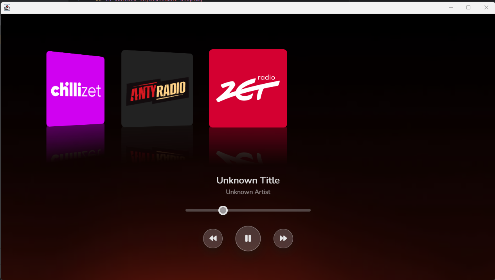
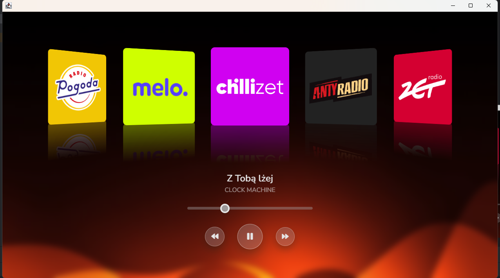

# IVI-Display
## In Vehicle Infotainment Display

Written in Java gui in JCEF communicates with Javalin.

### Done:
* Music Player with Polish radio stations using openfm 'api' and rds data from some stations (Design by [shobhitdev](https://shobhitdev.com/music-player-using-html-css-javascript/))
* Automatic loading of radio stations
* Volume control.

### TODO:
* Car settings
* Climate control
* Communicate with CAN using USB to CAN Adapter
* More GUIS (Back camera)
* Toggle FullScreen mode (can be enabled by uncommenting line 99 of JCEFFrame.java)

### Images

